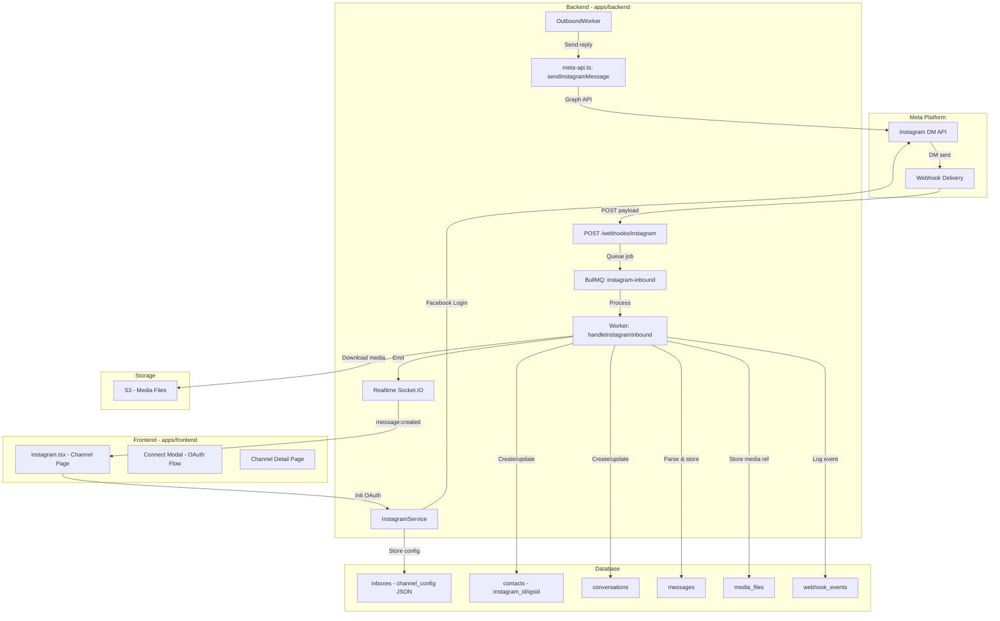
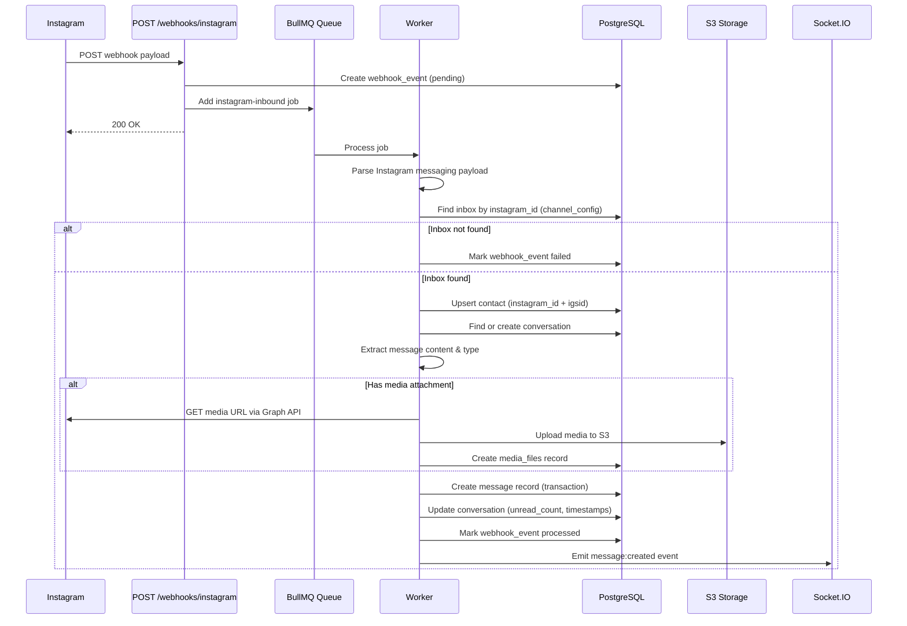
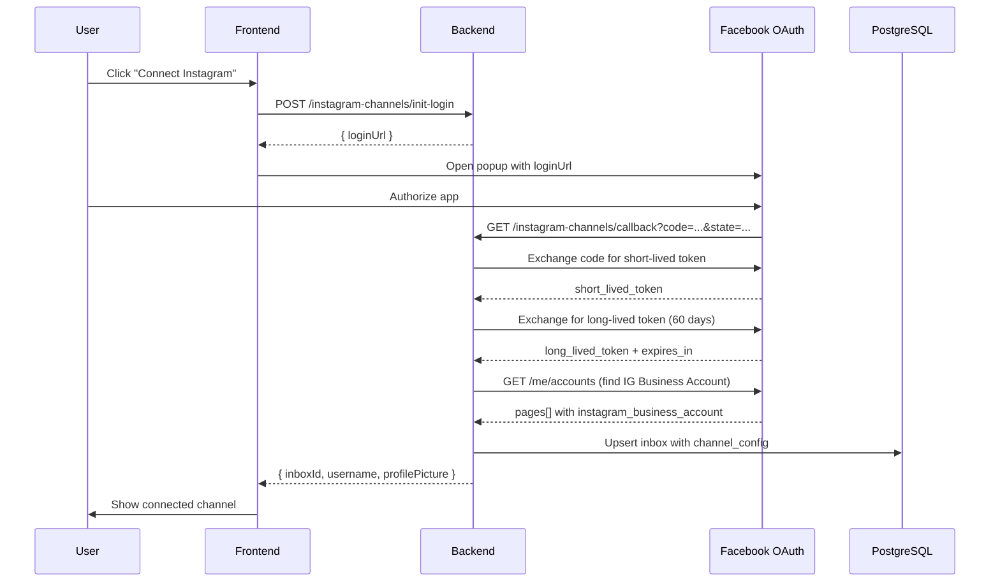
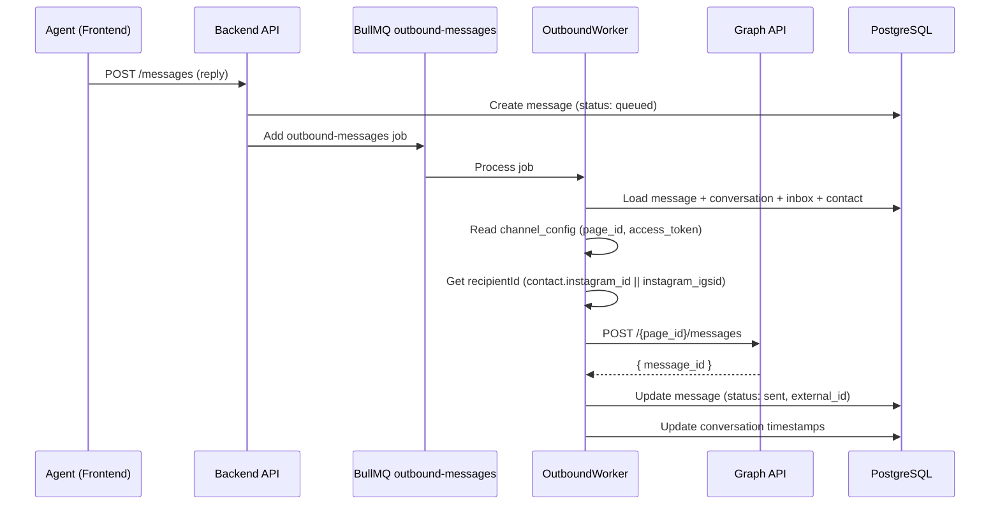

# Design Document: Instagram DM Integration

## Overview

This feature completes the partially-built Instagram DM integration by implementing inbound message processing, frontend channel management UI, contact/conversation creation from Instagram DMs, and media handling. The existing codebase already has OAuth flow, webhook routing, outbound message sending, and queue infrastructure in place. The work focuses on filling the gaps: parsing Instagram webhook payloads, storing inbound messages (mirroring the WhatsApp pattern), building the frontend channel page, and adding Instagram-specific API client methods.

The architecture follows the established WhatsApp integration pattern: webhook → queue → worker → store message → emit realtime event. Instagram uses Facebook's Messenger Platform for DMs, so the webhook payload format differs from WhatsApp (uses `messaging` array under `entry` instead of `changes` with `value.messages`). The existing `channel_config` JSON approach on `inboxes` is retained rather than creating a dedicated table, keeping the schema lightweight.

## Architecture



## Sequence Diagrams

### Inbound Message Flow



### OAuth Connection Flow



### Outbound Message Flow



## Components and Interfaces

### Component 1: Instagram Inbound Processor

**Purpose**: Parses Instagram webhook payloads and stores inbound DM messages, creating contacts and conversations as needed.

**Interface**:
```typescript
// In WebhookService (apps/backend/src/modules/webhook/service.ts)

interface InstagramWebhookPayload {
  object: 'instagram'
  entry: InstagramEntry[]
}

interface InstagramEntry {
  id: string           // Instagram Business Account ID or Page ID
  time: number         // Unix timestamp
  messaging: InstagramMessagingEvent[]
}

interface InstagramMessagingEvent {
  sender: { id: string }      // Instagram-scoped user ID (IGSID)
  recipient: { id: string }   // Page/IG Business Account ID
  timestamp: number
  message?: InstagramMessage
  read?: { mid: string; watermark: number }
  delivery?: { mids: string[]; watermark: number }
}

interface InstagramMessage {
  mid: string                  // Message ID
  text?: string                // Text content
  attachments?: InstagramAttachment[]
  reply_to?: { mid: string }   // Reply reference
  is_echo?: boolean            // Echo of sent message
  is_deleted?: boolean
}

interface InstagramAttachment {
  type: 'image' | 'video' | 'audio' | 'file' | 'share' | 'story_mention' | 'reel'
  payload: {
    url: string
    sticker_id?: number
    reel_video_id?: string
  }
}
```

**Responsibilities**:
- Parse Instagram webhook `messaging` array from each entry
- Skip echo messages (`is_echo: true`) and delivery/read receipts
- Match incoming messages to an inbox via `channel_config.instagram_id`
- Upsert contacts using `instagram_igsid` (sender ID)
- Create or find existing conversations
- Download and persist media attachments to S3
- Create message records with proper content_type mapping
- Emit realtime events for live UI updates
- Handle deduplication via `external_id` (message `mid`)

### Component 2: Instagram Media Handler

**Purpose**: Downloads Instagram media from Graph API URLs and uploads to S3.

**Interface**:
```typescript
// In WebhookService or a shared utility

interface InstagramMediaDownloadParams {
  appId: string
  inboxId: string
  contentType: string
  externalMessageId: string
  mediaUrl: string           // Direct URL from attachment payload
  accessToken: string        // Page access token for authenticated downloads
}

interface MediaUploadResult {
  mediaId: string
  publicUrl: string
  key: string
  originalUrl: string
  mimeType: string | null
  fileSize: number | null
}

async function persistInstagramMediaToS3(
  params: InstagramMediaDownloadParams
): Promise<MediaUploadResult | null>
```

**Responsibilities**:
- Download media from Instagram CDN URLs (some require auth token)
- Detect MIME type from response headers
- Generate unique S3 key: `{appId}/instagram/{inboxId}/{messageId}/{filename}`
- Upload to S3 with proper content-type
- Return public URL for storage in message content_attributes

### Component 3: Frontend Instagram Channel Page

**Purpose**: Provides UI for connecting, viewing, and managing Instagram DM channels.

**Interface**:
```typescript
// Route: apps/frontend/src/routes/$lang/$appId/channels/instagram.tsx

interface InstagramChannel {
  id: string
  name: string
  username: string
  profilePictureUrl?: string
  isActive: boolean
  connectedAt: string
  tokenExpiresAt: string
  daysUntilTokenExpiry: number
}

// API methods to add to frontend
interface InstagramAPI {
  getChannels(appId: string): Promise<InstagramChannel[]>
  initLogin(appId: string): Promise<{ loginUrl: string }>
  getChannelStatus(channelId: string): Promise<InstagramChannelStatus>
  deleteChannel(channelId: string): Promise<void>
}
```

**Responsibilities**:
- List connected Instagram channels with status indicators
- "Connect Instagram" button triggering OAuth popup flow
- Display channel details: username, profile picture, token expiry
- Token expiry warning when < 7 days remaining
- Disconnect/delete channel functionality
- Follow the same layout pattern as `whatsapp.tsx`

### Component 4: Instagram Service Enhancements

**Purpose**: Extend existing `InstagramService` with channel listing and Graph API version upgrade.

**Interface**:
```typescript
// In apps/backend/src/modules/instagram/service.ts

// New methods to add
abstract class InstagramService {
  // Existing methods (already implemented)
  static handleCallback(code: string, appId: string): Promise<CallbackResult>
  static getStatus(inboxId: string): Promise<StatusResult>
  static deleteConnection(inboxId: string): Promise<void>
  static refreshTokens(): Promise<void>

  // New methods needed
  static getChannels(appId: string): Promise<InstagramChannel[]>
  static getChannelById(inboxId: string): Promise<InstagramChannel | null>
}
```

**Responsibilities**:
- List all Instagram inboxes for an app (filter by `channel_type: 'instagram'`)
- Upgrade Graph API calls from v19.0 to v23.0
- Provide channel detail data for frontend consumption

## Data Models

### Inbox Channel Config (Instagram)

The Instagram integration uses the existing `inboxes.channel_config` JSON field rather than a dedicated table:

```typescript
interface InstagramChannelConfig {
  instagram_id: string           // Instagram Business Account ID
  username: string               // @username
  profile_picture_url?: string
  access_token: string           // Long-lived user access token
  page_access_token: string      // Page-specific access token
  token_expires_at: string       // ISO date string
  fb_page_id: string             // Facebook Page ID (used for sending)
}
```

**Validation Rules**:
- `instagram_id` must be non-empty and unique per app
- `access_token` and `page_access_token` must be non-empty
- `token_expires_at` must be a valid ISO date in the future
- `fb_page_id` must be non-empty (required for sending messages)

### Contact Fields (Instagram-specific)

```typescript
// Existing fields on contacts model
interface InstagramContactFields {
  instagram_id: string | null     // Instagram Business Account ID (for business accounts)
  instagram_igsid: string | null  // Instagram-scoped user ID (from webhook sender.id)
}
```

**Validation Rules**:
- At least one of `instagram_id` or `instagram_igsid` must be set for Instagram contacts
- `instagram_igsid` is the primary identifier from webhook payloads (sender.id)
- Contact identifier format: `ig:{app_id}:{igsid}`

### Message Content Type Mapping

```typescript
// Instagram attachment type → internal content_type
const INSTAGRAM_CONTENT_TYPE_MAP: Record<string, string> = {
  'text': 'text',
  'image': 'image',
  'video': 'video',
  'audio': 'audio',
  'file': 'document',
  'share': 'link',
  'story_mention': 'story_mention',
  'reel': 'reel',
}
```


## Algorithmic Pseudocode

### Instagram Inbound Message Processing

```typescript
// WebhookService.handleInstagramInbound()
// Replaces the current stub implementation

static async handleInstagramInbound(payload: any, webhookEventId?: string) {
  const stats = { messagesCreated: 0, duplicates: 0, unknownChannel: 0, errors: 0 }
  const errors: string[] = []
  let resolvedAppId: string | null = null
  let resolvedInboxId: string | null = null

  try {
    const entries: any[] = Array.isArray(payload?.entry) ? payload.entry : []

    for (const entry of entries) {
      const messagingEvents: any[] = Array.isArray(entry?.messaging) ? entry.messaging : []

      for (const event of messagingEvents) {
        // Skip non-message events (read receipts, delivery confirmations, echoes)
        if (!event.message || event.message.is_echo || event.message.is_deleted) continue
        if (event.read || event.delivery) continue

        const senderId = event.sender?.id
        const recipientId = event.recipient?.id
        if (!senderId || !recipientId) continue

        // Find inbox by matching recipient ID to channel_config.instagram_id or fb_page_id
        const inbox = await findInstagramInbox(recipientId)
        if (!inbox) {
          stats.unknownChannel++
          errors.push(`No inbox found for recipient_id=${recipientId}`)
          continue
        }

        resolvedAppId = resolvedAppId || inbox.app_id
        resolvedInboxId = resolvedInboxId || inbox.id

        try {
          const result = await storeIncomingInstagramMessage({
            inbox,
            event,
          })
          if (result.status === 'duplicate') {
            stats.duplicates++
          } else {
            stats.messagesCreated++
            await emitInstagramMessageCreatedEvent(result)
          }
        } catch (error: any) {
          stats.errors++
          errors.push(error?.message || 'Failed to process Instagram message')
        }
      }
    }
  } finally {
    if (webhookEventId) {
      const processedCount = stats.messagesCreated + stats.duplicates
      const shouldFail = stats.errors > 0 && processedCount === 0

      await prisma.webhook_events.update({
        where: { id: webhookEventId },
        data: {
          status: shouldFail ? 'failed' : 'processed',
          processed_at: new Date(),
          updated_at: new Date(),
          error_message: errors.length > 0 ? errors.join(' | ').slice(0, 1000) : null,
          app_id: resolvedAppId || undefined,
          inbox_id: resolvedInboxId || undefined,
        },
      })
    }
  }

  return { success: stats.errors === 0, stats, errors }
}
```

### Find Instagram Inbox

```typescript
async function findInstagramInbox(recipientId: string) {
  // Instagram webhooks send recipient.id which can be the IG Business Account ID
  // or the Facebook Page ID. We check both fields in channel_config.
  const inbox = await prisma.inboxes.findFirst({
    where: {
      channel_type: 'instagram',
      is_active: true,
      deleted_at: null,
      OR: [
        { channel_config: { path: ['instagram_id'], equals: recipientId } },
        { channel_config: { path: ['fb_page_id'], equals: recipientId } },
      ],
    },
  })

  if (!inbox) return null

  const config = inbox.channel_config as any
  return {
    id: inbox.id,
    app_id: inbox.app_id!,
    name: inbox.name,
    config: {
      instagram_id: config.instagram_id,
      username: config.username,
      access_token: config.access_token,
      page_access_token: config.page_access_token,
      fb_page_id: config.fb_page_id,
      profile_picture_url: config.profile_picture_url,
    },
  }
}
```

### Store Incoming Instagram Message

```typescript
async function storeIncomingInstagramMessage(params: {
  inbox: ResolvedInstagramInbox
  event: InstagramMessagingEvent
}) {
  const { inbox, event } = params
  const message = event.message!
  const mid = message.mid
  const senderId = event.sender.id
  const messageAt = new Date(event.timestamp)
  const windowExpiresAt = new Date(messageAt.getTime() + 24 * 60 * 60 * 1000) // 24h window

  // 1. Upsert contact
  const deterministicIdentifier = `ig:${inbox.app_id}:${senderId}`
  const existingContact = await prisma.contacts.findFirst({
    where: {
      app_id: inbox.app_id,
      deleted_at: null,
      OR: [
        { identifier: deterministicIdentifier },
        { instagram_igsid: senderId },
      ],
    },
  })

  const contact = existingContact
    ? await prisma.contacts.update({
        where: { id: existingContact.id },
        data: {
          identifier: existingContact.identifier || deterministicIdentifier,
          instagram_igsid: senderId,
          last_inbound_message_at: messageAt,
          last_message_at: messageAt,
          window_expires_at: windowExpiresAt,
          channel_type: 'instagram',
          app_id: inbox.app_id,
          deleted_at: null,
          updated_at: new Date(),
        },
      })
    : await prisma.contacts.create({
        data: {
          identifier: deterministicIdentifier,
          name: senderId, // Will be updated if profile info available
          instagram_igsid: senderId,
          channel_type: 'instagram',
          app_id: inbox.app_id,
          first_contact_at: messageAt,
          last_inbound_message_at: messageAt,
          last_message_at: messageAt,
          window_expires_at: windowExpiresAt,
          source: 'instagram_webhook',
          created_at: messageAt,
        },
      })

  // 2. Find or create conversation
  let conversation = await prisma.conversations.findFirst({
    where: {
      app_id: inbox.app_id,
      inbox_id: inbox.id,
      contact_id: contact.id,
      channel_type: 'instagram',
      deleted_at: null,
    },
    orderBy: { updated_at: 'desc' },
  })

  if (!conversation) {
    conversation = await prisma.conversations.create({
      data: {
        app_id: inbox.app_id,
        inbox_id: inbox.id,
        contact_id: contact.id,
        channel_type: 'instagram',
        status: 'open',
        unread_count: 0,
        last_message_at: messageAt,
        last_activity_at: messageAt,
        messaging_window_open: true,
        is_within_messaging_window: true,
        messaging_window_opened_at: messageAt,
        messaging_window_expires_at: windowExpiresAt,
        created_at: messageAt,
        updated_at: messageAt,
      },
    })
  }

  // 3. Extract content and handle media
  const { content, contentType, contentAttributes } = extractInstagramMessageContent(message)

  let mediaUploadResult = null
  if (contentType !== 'text' && message.attachments?.length) {
    const attachment = message.attachments[0]
    mediaUploadResult = await persistInstagramMediaToS3({
      appId: inbox.app_id,
      inboxId: inbox.id,
      contentType,
      externalMessageId: mid,
      mediaUrl: attachment.payload.url,
      accessToken: inbox.config.page_access_token,
    })
  }

  // 4. Persist message in transaction with dedup lock
  const persistedPayload = await prisma.$transaction(async (tx) => {
    await tx.$queryRaw`SELECT pg_advisory_xact_lock(hashtext(${mid})::bigint)`

    const existing = await tx.messages.findFirst({
      where: { external_id: mid, deleted_at: null },
      select: { id: true },
    })
    if (existing) return null

    const createdMessage = await tx.messages.create({
      data: {
        conversation_id: conversation.id,
        app_id: inbox.app_id,
        inbox_id: inbox.id,
        message_type: 'incoming',
        sender_type: 'contact',
        sender_id: contact.id,
        content,
        content_type: contentType,
        content_attributes: contentAttributes as any,
        external_id: mid,
        status: 'sent',
        raw_payload: params.event as any,
        created_at: messageAt,
        updated_at: new Date(),
      },
    })

    // Create media_files record if media was uploaded
    if (mediaUploadResult) {
      await tx.media_files.create({
        data: {
          platform: 'instagram',
          media_id: mediaUploadResult.mediaId,
          message_id: createdMessage.id,
          media_type: contentType,
          mime_type: mediaUploadResult.mimeType,
          media_url: mediaUploadResult.originalUrl,
          local_url: mediaUploadResult.publicUrl,
          download_status: 'downloaded',
          downloaded_at: new Date(),
          updated_at: new Date(),
        },
      })
    }

    const updatedConversation = await tx.conversations.update({
      where: { id: conversation.id },
      data: {
        status: 'open',
        unread_count: { increment: 1 },
        last_message_at: messageAt,
        last_activity_at: messageAt,
        messaging_window_open: true,
        is_within_messaging_window: true,
        messaging_window_opened_at: messageAt,
        messaging_window_expires_at: windowExpiresAt,
        updated_at: new Date(),
      },
    })

    return { createdMessage, updatedConversation }
  })

  if (!persistedPayload) return { status: 'duplicate' as const }

  return {
    status: 'created' as const,
    appId: inbox.app_id,
    conversationId: persistedPayload.updatedConversation.id,
    message: persistedPayload.createdMessage,
    contact: { id: contact.id, name: contact.name, identifier: contact.identifier },
    channelName: inbox.name || null,
  }
}
```

### Extract Instagram Message Content

```typescript
function extractInstagramMessageContent(message: InstagramMessage): {
  content: string
  contentType: string
  contentAttributes: Record<string, any>
} {
  // Text-only message
  if (message.text && !message.attachments?.length) {
    return {
      content: message.text,
      contentType: 'text',
      contentAttributes: {},
    }
  }

  // Message with attachments
  if (message.attachments?.length) {
    const attachment = message.attachments[0]
    const type = attachment.type

    const contentTypeMap: Record<string, string> = {
      image: 'image',
      video: 'video',
      audio: 'audio',
      file: 'document',
      share: 'link',
      story_mention: 'story_mention',
      reel: 'reel',
    }

    const contentType = contentTypeMap[type] || 'text'
    const content = message.text || `[${type}]`

    return {
      content,
      contentType,
      contentAttributes: {
        media: {
          url: attachment.payload.url,
          type: contentType,
          sticker_id: attachment.payload.sticker_id,
          reel_video_id: attachment.payload.reel_video_id,
        },
        ...(message.reply_to ? { reply_to: { mid: message.reply_to.mid } } : {}),
      },
    }
  }

  // Fallback
  return {
    content: message.text || '',
    contentType: 'text',
    contentAttributes: {},
  }
}
```

## Key Functions with Formal Specifications

### Function 1: handleInstagramInbound()

```typescript
static async handleInstagramInbound(
  payload: InstagramWebhookPayload,
  webhookEventId?: string
): Promise<{ success: boolean; stats: InboundStats; errors: string[] }>
```

**Preconditions:**
- `payload` is a valid object (may have empty/missing `entry` array)
- `webhookEventId`, if provided, references an existing `webhook_events` record with status `pending`
- Database connection is available

**Postconditions:**
- Every message event in `payload.entry[].messaging[]` is either processed or recorded as an error
- `stats.messagesCreated + stats.duplicates + stats.unknownChannel + stats.errors` equals total message events encountered
- If `webhookEventId` provided: webhook_event status is updated to `processed` or `failed`
- `success === true` if and only if `stats.errors === 0`
- No echo messages (`is_echo: true`) are stored as incoming messages

**Loop Invariants:**
- For each entry iteration: all previously processed entries have their messages stored or errors recorded
- For each messaging event iteration: stats counters accurately reflect all previously processed events

### Function 2: storeIncomingInstagramMessage()

```typescript
private static async storeIncomingInstagramMessage(params: {
  inbox: ResolvedInstagramInbox
  event: InstagramMessagingEvent
}): Promise<{ status: 'created' | 'duplicate'; ... }>
```

**Preconditions:**
- `params.inbox` is a valid resolved inbox with non-null `app_id` and valid `config`
- `params.event.message` is defined and has a non-empty `mid`
- `params.event.sender.id` is a non-empty string

**Postconditions:**
- A contact exists with `instagram_igsid === event.sender.id` and `app_id === inbox.app_id`
- A conversation exists linking the contact to the inbox
- If `status === 'created'`: exactly one new message record exists with `external_id === event.message.mid`
- If `status === 'duplicate'`: no new message was created, existing message is unchanged
- Contact's `window_expires_at` is set to `event.timestamp + 24 hours`
- Conversation's `messaging_window_expires_at` is set to `event.timestamp + 24 hours`
- If media attachment present and download succeeds: `media_files` record exists with `platform === 'instagram'`

**Loop Invariants:** N/A (no loops in this function)

### Function 3: findInstagramInbox()

```typescript
private static async findInstagramInbox(
  recipientId: string
): Promise<ResolvedInstagramInbox | null>
```

**Preconditions:**
- `recipientId` is a non-empty string

**Postconditions:**
- Returns `null` if no active, non-deleted inbox has `channel_config.instagram_id === recipientId` or `channel_config.fb_page_id === recipientId`
- If returned non-null: `result.app_id` is non-null, `result.config.access_token` is non-empty
- No mutations to any database records

### Function 4: extractInstagramMessageContent()

```typescript
function extractInstagramMessageContent(
  message: InstagramMessage
): { content: string; contentType: string; contentAttributes: Record<string, any> }
```

**Preconditions:**
- `message` is a valid InstagramMessage object

**Postconditions:**
- `contentType` is one of: `'text'`, `'image'`, `'video'`, `'audio'`, `'document'`, `'link'`, `'story_mention'`, `'reel'`
- If `message.text` is defined and no attachments: `contentType === 'text'` and `content === message.text`
- If attachments present: `contentAttributes.media.url` contains the attachment URL
- `content` is never null (falls back to empty string)
- No side effects, pure function

### Function 5: persistInstagramMediaToS3()

```typescript
async function persistInstagramMediaToS3(
  params: InstagramMediaDownloadParams
): Promise<MediaUploadResult | null>
```

**Preconditions:**
- `params.mediaUrl` is a valid HTTP(S) URL
- `params.accessToken` is a valid page access token (for authenticated media)
- S3 client is configured and bucket exists

**Postconditions:**
- If successful: S3 object exists at key `{appId}/instagram/{inboxId}/{messageId}/{filename}`
- If successful: returned `publicUrl` is a valid accessible URL
- If download or upload fails: returns `null`, does not throw
- Original media URL is preserved in `originalUrl` field

## Example Usage

### Processing an Instagram DM Webhook

```typescript
// Incoming webhook payload from Instagram
const payload = {
  object: 'instagram',
  entry: [{
    id: '17841400123456789',  // IG Business Account ID
    time: 1700000000,
    messaging: [{
      sender: { id: '67890' },      // User's IGSID
      recipient: { id: '17841400123456789' },
      timestamp: 1700000000000,
      message: {
        mid: 'm_abc123def456',
        text: 'Hello, I have a question about your product'
      }
    }]
  }]
}

// This is called by the worker when processing the instagram-inbound queue job
const result = await WebhookService.handleInstagramInbound(payload, webhookEventId)
// result: { success: true, stats: { messagesCreated: 1, duplicates: 0, ... }, errors: [] }
```

### Processing an Instagram DM with Image

```typescript
const payloadWithImage = {
  object: 'instagram',
  entry: [{
    id: '17841400123456789',
    time: 1700000000,
    messaging: [{
      sender: { id: '67890' },
      recipient: { id: '17841400123456789' },
      timestamp: 1700000000000,
      message: {
        mid: 'm_img789',
        attachments: [{
          type: 'image',
          payload: {
            url: 'https://scontent.xx.fbcdn.net/v/t1.0-9/photo.jpg?...'
          }
        }]
      }
    }]
  }]
}
// Image is downloaded from CDN, uploaded to S3, media_files record created
```

### Frontend: Listing Instagram Channels

```typescript
// In instagram.tsx
const fetchChannels = async () => {
  const response = await fetch(`${API_BASE}/instagram-channels`, {
    headers: getApiHeaders(),
  })
  const data = await response.json()
  setChannels(data.data) // Array of { id, name, username, isActive, ... }
}
```

### Frontend: Initiating Instagram Connection

```typescript
const connectInstagram = async () => {
  const response = await fetch(`${API_BASE}/instagram-channels/init-login`, {
    method: 'POST',
    headers: getApiHeaders(true),
  })
  const { data } = await response.json()

  // Open Facebook OAuth popup
  const popup = window.open(data.loginUrl, 'instagram-connect', 'width=600,height=700')

  // Listen for callback result
  window.addEventListener('message', (event) => {
    if (event.data.type === 'IG_SUCCESS') {
      fetchChannels() // Refresh channel list
      popup?.close()
    }
  })
}
```

## Correctness Properties

*A property is a characteristic or behavior that should hold true across all valid executions of a system-essentially, a formal statement about what the system should do. Properties serve as the bridge between human-readable specifications and machine-verifiable correctness guarantees.*

### Property 1: Stats conservation invariant

*For any* Instagram webhook payload containing N messaging events (including echoes, read receipts, delivery confirmations, and valid messages), after processing, `stats.messagesCreated + stats.duplicates + stats.unknownChannel + stats.errors` equals N minus the number of skipped events (echoes, read receipts, delivery confirmations, events missing sender/recipient).

**Validates: Requirements 1.7**

### Property 2: Event filtering

*For any* messaging event that has `is_echo` set to true, or contains a `read` or `delivery` field, processing that event shall not create a message record in the database.

**Validates: Requirements 1.2, 1.3**

### Property 3: Message deduplication (idempotence)

*For any* message with a given `mid`, processing it twice shall result in exactly one message record in the database, and the second processing shall return `{ status: 'duplicate' }`.

**Validates: Requirements 2.2**

### Property 4: Contact creation correctness

*For any* inbound message from sender S to inbox with app_id A, after processing, there exists exactly one contact with `instagram_igsid === S`, `app_id === A`, `identifier === 'ig:{A}:{S}'`, and `channel_type === 'instagram'`.

**Validates: Requirements 3.1, 3.2, 3.5**

### Property 5: Messaging window calculation

*For any* inbound message with timestamp T, after processing, both `contact.window_expires_at` and `conversation.messaging_window_expires_at` are set to `T + 24 hours`, and `conversation.messaging_window_open` is true.

**Validates: Requirements 3.4, 4.4**

### Property 6: Conversation creation and update

*For any* inbound message for a contact/inbox pair, after processing, a conversation exists with `channel_type === 'instagram'`, `status === 'open'`, correct `inbox_id` and `contact_id`, and `unread_count` incremented by one from its previous value.

**Validates: Requirements 4.1, 4.2, 4.3**

### Property 7: Content extraction completeness

*For any* valid `InstagramMessage` object, `extractInstagramMessageContent` returns a non-null `content` string, a `contentType` from the set `{text, image, video, audio, document, link, story_mention, reel}`, and if attachments are present, `contentAttributes.media.url` contains the attachment URL. For text-only messages, `contentType === 'text'` and `content === message.text`. For attachment-only messages, `content === '[{type}]'`.

**Validates: Requirements 5.1, 5.2, 5.3, 5.4, 5.6**

### Property 8: Media persistence on success

*For any* inbound message with a media attachment where the download succeeds, a `media_files` record exists with `platform === 'instagram'` and `download_status === 'downloaded'`, and the S3 key follows the format `{appId}/instagram/{inboxId}/{messageId}/{filename}`.

**Validates: Requirements 6.2, 6.3**

### Property 9: Inbox resolution correctness

*For any* recipient ID, the Inbox_Resolver returns a matching active, non-deleted inbox where `channel_config.instagram_id` or `channel_config.fb_page_id` equals the recipient ID, or returns null if no match exists. The resolver never modifies database records.

**Validates: Requirements 7.1, 7.2, 7.3**

### Property 10: Webhook event lifecycle

*For any* webhook event created with status `pending`, after processing completes, the status is either `processed` or `failed` (never remains `pending`), and `processed_at`, `app_id`, and `inbox_id` are set when available.

**Validates: Requirements 1.8, 11.1, 11.2**

### Property 11: External ID preservation

*For any* valid inbound message with `mid` X that is successfully stored, the created message record has `external_id === X`.

**Validates: Requirements 1.6**

### Property 12: Token expiry warning threshold

*For any* Instagram channel displayed on the Channel_Page, if `daysUntilTokenExpiry` is less than 7, a warning indicator is displayed.

**Validates: Requirements 8.4**

### Property 13: Channel listing filter correctness

*For any* app ID, `getChannels` returns only inboxes where `channel_type === 'instagram'`, `is_active === true`, and `deleted_at` is null, all belonging to the given app ID.

**Validates: Requirements 9.1**

### Property 14: Outbound message routing

*For any* outbound message queued for an Instagram conversation, the Outbound_Worker reads `page_id` and `access_token` from the inbox's Channel_Config and uses the contact's `instagram_id` or `instagram_igsid` as the recipient ID. On success, the message status is updated to `sent` with the returned `message_id` as `external_id`.

**Validates: Requirements 12.1, 12.2, 12.3**

### Property 15: Token refresh scope

*For any* set of active Instagram inboxes, the token refresh job selects only those with `token_expires_at` within 7 days, and a failure refreshing one inbox does not prevent refreshing the remaining inboxes.

**Validates: Requirements 14.1, 14.3**

## Error Handling

### Error Scenario 1: Unknown Instagram Channel

**Condition**: Webhook payload contains a `recipient.id` that doesn't match any active inbox's `channel_config.instagram_id` or `channel_config.fb_page_id`
**Response**: Increment `stats.unknownChannel`, log error message, continue processing remaining events
**Recovery**: Admin connects the Instagram account via the frontend, future webhooks will match

### Error Scenario 2: Expired Access Token

**Condition**: Media download or outbound message fails with Graph API error `190` (expired/invalid token)
**Response**: Log error, mark message as failed, continue processing other messages
**Recovery**: Token refresh cron job (`InstagramService.refreshTokens()`) runs periodically to refresh tokens expiring within 7 days. User can also reconnect via OAuth.

### Error Scenario 3: Duplicate Message (Race Condition)

**Condition**: Same webhook delivered twice (Meta retries), two workers process simultaneously
**Response**: PostgreSQL advisory lock on `hashtext(mid)` prevents duplicate inserts. Second worker gets `null` from transaction and returns `{ status: 'duplicate' }`
**Recovery**: Automatic, no intervention needed

### Error Scenario 4: Media Download Failure

**Condition**: Instagram CDN URL is expired or inaccessible
**Response**: `persistInstagramMediaToS3` returns `null`, message is still created with content_attributes containing the original URL but no S3 URL
**Recovery**: Media URL preserved in raw_payload for potential retry

### Error Scenario 5: Database Transaction Failure

**Condition**: Database connection lost or constraint violation during message creation
**Response**: Transaction rolls back, error is caught and added to `errors` array, `stats.errors` incremented
**Recovery**: Webhook event marked as `failed`, can be replayed via `replayPendingWebhookEvents`

## Testing Strategy

### Unit Testing Approach

- Test `extractInstagramMessageContent()` with all attachment types (text, image, video, audio, file, share, story_mention, reel)
- Test `findInstagramInbox()` matching logic (by instagram_id, by fb_page_id, no match)
- Test payload parsing: valid payloads, empty entries, missing fields, echo messages
- Test content type mapping completeness
- Mock Prisma client for database interaction tests

### Property-Based Testing Approach

**Property Test Library**: fast-check

- Generate random Instagram webhook payloads and verify:
  - `messagesCreated + duplicates + unknownChannel + errors === total events`
  - No echo messages are stored
  - All created messages have valid `external_id` matching the input `mid`
  - Contact `instagram_igsid` always matches `sender.id`

### Integration Testing Approach

- End-to-end test: POST webhook payload → verify message appears in database with correct fields
- Test deduplication: POST same payload twice → verify only one message created
- Test media flow: POST payload with image attachment → verify S3 upload and media_files record
- Test OAuth flow: Mock Facebook Graph API responses → verify inbox creation with correct channel_config
- Test outbound: Create message → verify `sendInstagramMessage` called with correct page_id and recipient_id

## Performance Considerations

- Instagram webhook payloads are processed asynchronously via BullMQ queue, so webhook endpoint returns 200 immediately
- Advisory lock scope is per-message (`mid`), so parallel processing of different messages is not blocked
- Inbox lookup by `channel_config` JSON path uses Prisma's JSON filtering; consider adding a GIN index on `channel_config` if query performance degrades with many inboxes
- Media downloads are done inline during message processing; for high-volume accounts, consider a separate media download queue
- Token refresh runs as a scheduled job, not on every request

## Security Considerations

- Access tokens stored in `channel_config` JSON field; ensure database encryption at rest
- Webhook verification uses shared `META_VERIFY_TOKEN` (same as WhatsApp) for GET verification endpoint
- Instagram webhook POST payloads should be validated with `X-Hub-Signature-256` header using app secret (not yet implemented, should be added)
- Page access tokens are long-lived (60 days); refresh job must run reliably to prevent service interruption
- OAuth state parameter is base64-encoded JSON with `appId` and `timestamp`; consider adding HMAC signature to prevent tampering
- Media URLs from Instagram CDN may contain auth tokens; never expose raw CDN URLs to frontend clients, always serve via S3

## Dependencies

- **Facebook Graph API v23.0**: OAuth token exchange, page discovery, message sending, media access
- **BullMQ + Redis**: Job queue for async webhook processing (`instagram-inbound` queue)
- **AWS S3**: Media file storage (via existing `@aws-sdk/client-s3`)
- **Prisma**: Database ORM for PostgreSQL
- **Socket.IO**: Realtime event emission for live message updates
- **Elysia**: HTTP framework for webhook endpoints and API routes
- **TanStack Router**: Frontend routing for Instagram channel page
